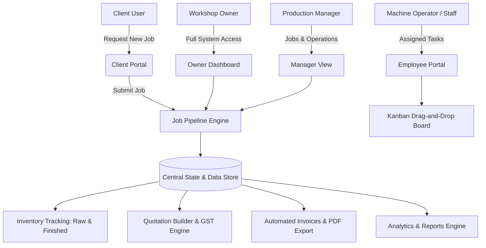

# 🛠️ Mistry Gems — MSME Manufacturing Workshop Platform

> A modern, high-performance workflow management platform for MSME job-work manufacturing workshops. Streamlines job tracking, raw material inventory, quotation building, automated invoicing, task drag-and-drop Kanban, and role-based access control.

---

## 📐 Platform Architecture & Flow



---

## 🔒 Role-Based Access Control (RBAC) Matrix

| Feature / Module | Owner 👑 | Manager 📊 | Employee 🛠️ | Client 👤 |
| :--- | :---: | :---: | :---: | :---: |
| **Full Dashboard & Financial KPIs** | ✅ | ❌ (No Revenue) | ❌ | ❌ |
| **Client Portal View** | ❌ | ❌ | ❌ | ✅ |
| **Job Management (Table & Kanban)** | ✅ | ✅ | ❌ | 👁️ (Own Jobs Only) |
| **Task Board (dnd-kit Drag-and-Drop)**| ✅ | ✅ | ✅ (Assigned Only) | ❌ |
| **Inventory Management** | ✅ | ✅ | ❌ | ❌ |
| **Quotation Builder** | ✅ | ✅ | ❌ | ❌ |
| **Invoice Management** | ✅ | ❌ | ❌ | ❌ |
| **Analytics & Reports** | ✅ | ❌ | ❌ | ❌ |
| **System Settings** | ✅ | ❌ | ❌ | ❌ |

---

## 🔄 Job Lifecycle Pipeline

```
[ New ] ➔ [ Quoted ] ➔ [ Approved ] ➔ [ Procuring ] ➔ [ In Progress ] ➔ [ Quality Check ] ➔ [ Completed ] ➔ [ Invoiced ]
```

* **Workshop Procures**: Workshop orders raw materials directly for the job.
* **Client Supplies**: Client provides raw stock for custom machining/job-work.

---

## ✨ Feature Highlights

* **🎨 VisionOS-Inspired Dark/Light UI**: Built with glassmorphism, dynamic gradients, glowing indicators, and an **Amber (`#F97316`)** primary accent theme.
* **📋 Dual-View Job Management**: Toggle between a high-density data table and a interactive 8-stage Kanban board.
* **🎯 Interactive Task Board**: Drag-and-drop tasks seamlessly between status columns (*Pending*, *In Progress*, *Review/QC*, *Completed*) using `@dnd-kit`.
* **📦 Raw Materials & Finished Goods Inventory**: Real-time stock tracking with status badges (`OK`, `Low Stock`, `Out of Stock`) and Stock In/Out modals.
* **🧾 Quotation & Invoicing Engine**: Live GST calculation (5% Job Work default, 12%, 18%) and automated invoice generation with PDF export functionality.
* **💬 Multi-Channel Notifications**: Real-time alert feed tagged by delivery channel (WhatsApp, SMS, In-App).

---

## 📁 Repository Directory Structure

```text
Mistrygems_prototype-main/
├── src/
│   ├── components/
│   │   ├── layout/
│   │   │   ├── Layout.tsx        # Responsive layout wrapper with Client Portal switch
│   │   │   ├── Sidebar.tsx       # Role-filtered navigation sidebar
│   │   │   └── Topbar.tsx        # Company switcher, notification bell, role profile
│   │   └── ui/
│   │       ├── Charts.tsx        # Recharts wrappers for revenue & performance
│   │       ├── GlassCard.tsx     # Glassmorphism container component
│   │       └── StatusBadge.tsx   # Job status, priority, and mode badges
│   ├── context/
│   │   ├── AuthContext.tsx       # Authentication & role state provider
│   │   ├── SidebarContext.tsx    # Sidebar collapse state
│   │   └── ThemeContext.tsx      # Dark/Light theme provider
│   ├── lib/
│   │   ├── data.ts               # Centralized MSME manufacturing mock data
│   │   └── utils.ts              # Currency, date, and class merging utilities
│   ├── pages/
│   │   ├── Dashboard.tsx         # Role-aware dashboard & Client Portal
│   │   ├── Employees.tsx         # Staff directory & performance tracking
│   │   ├── Inventory.tsx         # Raw materials & finished goods stock management
│   │   ├── Invoices.tsx          # Billing & automated invoice generator
│   │   ├── Jobs.tsx              # Job-work table & Kanban management
│   │   ├── Login.tsx            # Role selection login page
│   │   ├── Notifications.tsx     # Notification center with channel badges
│   │   ├── Quotations.tsx        # Live quotation calculation tool
│   │   ├── Reports.tsx          # Analytical department & velocity reports
│   │   ├── Settings.tsx         # Company profile & RBAC configuration
│   │   └── Tasks.tsx             # dnd-kit drag-and-drop task board
│   ├── App.tsx                   # Lazy-loaded router & auth guard
│   ├── index.css                 # Tailwind design system & custom scrollbars
│   └── main.tsx                  # React DOM root entry point
├── public/                       # Static web assets
├── package.json                  # Dependencies & script configurations
├── tailwind.config.js            # Tailwind color extensions & animations
├── vite.config.ts                # Vite build bundler configuration
└── README.md                     # Project documentation
```

---

## 🚀 Quickstart & Setup Guide

### 1. Prerequisites
Ensure you have **Node.js** (v18 or higher) and **npm** installed.

### 2. Installation
Clone the repository and install project dependencies:
```bash
git clone https://github.com/Saisidd05/Mistrygems_prototype.git
cd Mistrygems_prototype
npm install
```

### 3. Run Local Development Server
Launch the Vite development server:
```bash
npm run dev
```
Open your browser at `http://localhost:5173/Mistrygems_prototype/`

### 4. Build for Production
Compile TypeScript and generate optimized production bundle:
```bash
npm run build
```

---

## 🛠️ Technology Stack

* **Frontend Framework**: [React 18](https://reactjs.org/) + [TypeScript](https://www.typescriptlang.org/)
* **Build Tool**: [Vite](https://vitejs.dev/)
* **Styling & Design**: [Tailwind CSS](https://tailwindcss.com/) + Custom Glassmorphism System
* **Animations**: [Framer Motion](https://www.framer.com/motion/)
* **Drag and Drop**: [@dnd-kit/core](https://dndkit.com/) + [@dnd-kit/sortable](https://dndkit.com/)
* **Charts**: [Recharts](https://recharts.org/)
* **Icons**: [Lucide React](https://lucide.dev/)

---

## 📄 License
Distributed under the MIT License. See `LICENSE` for more details.
